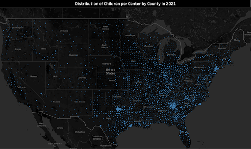

# Dataminers

# Members
Zizheng  Zhang (Sean)
Tel: 301-742-4626
Bio:
- Bachelor of Arts, Beijing University of Chemical Technology (Beijing, 2014-2019)
- Junior Software Developer (C#, Unity, and .Net), JHBY Tech Co. Ltd. (Beijing, 2019-2022)
- Master of Science, University of Maryland, College Park (College Park, 2022-2023)

Yinming Gao (Randall)

# Abstract - Analysis of Head Start Accessibility across the Continental U.S.
Established in 1965, Head Start promotes school readiness for children in low-income families by offering educational, nutritional, health, social, and other services. The program is rooted in urban, suburban, and rural communities throughout the nation.

To better facitilate the course of Head Start, we analyzed public data to estimate the accessibility of Head Start program in the continental United States. We constructed multiple metrics to measure and compare the accessibility of Head Start across the states and counties. The areas where communities might be underserved are identified by our metrics. Our analysis will help policy makers and federal agents to facilitate the equal access to Head Start.

# Technologies In-use
Python: for data extraction, data analysis, and statistical modelling.

Tableau: for data visualization.

PowerPoint: for presentation of insights.

# List of Python Libraries
Please see the requirement.txt for a comprehensive list of all the used Python libraries in this project.
For successul execution of our notebook, please run command `pip install -r requirements.txt` in project directory. The command will automatically install all the Python libraries dependencies. The command requires the installation of PIP, a widely used Python package manager.

# Sample Visualizations

# Major Findings
We found that there are clusters of counties in both Texas and Georgia where the metric children per center have abnormaly high values, indicating potential scarcity of Head Start recourse in those areas. Policy makers may need to find more Head Start participants in those areas so as to facilitate the accessibility of Head Start.

Nevada, Idaho, Arizona, Georgia, and Texas are the states with the lowest estimated enrollment rate, meaning that the communities in these five states are very being underserved. Policy makers may need to increase the public exposure of Head Start, especially to the low income families, so that the low income families are aware of Head Start and begin enrolling Head Start.

A linear regression model was built to better understand and evaluate the funding policy of Head Start. The model suggests strong correlation between funding amount, enrollment amount, and regional personal income level, showing that the funding policy of Head Start is well tailored to the actual situation of each state.

# Major Achievements
To accurately measure the impact and current situation of Head Start, we constrcuted multiple useful metrics to support our argument. The metrics that we have constructed and used include:
- Children per Center
- Fund per Child
- Funding Index
- Enrollment Rate
- Center Coverage Rate

Each of the metrics are intended to solve one or a group of closely related questions. And they performed well both measuring the program impact and identifying potential inequality. We believe that our metrics can also inspire data analytics practioners to build more precise and unbiased metrics in their own domain of work.